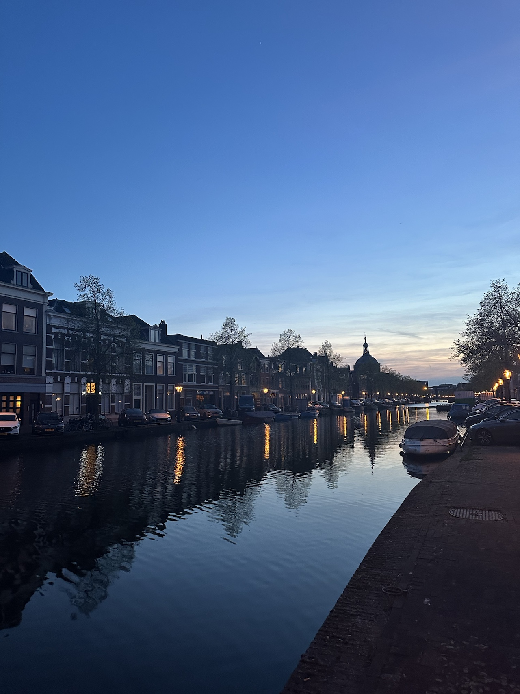
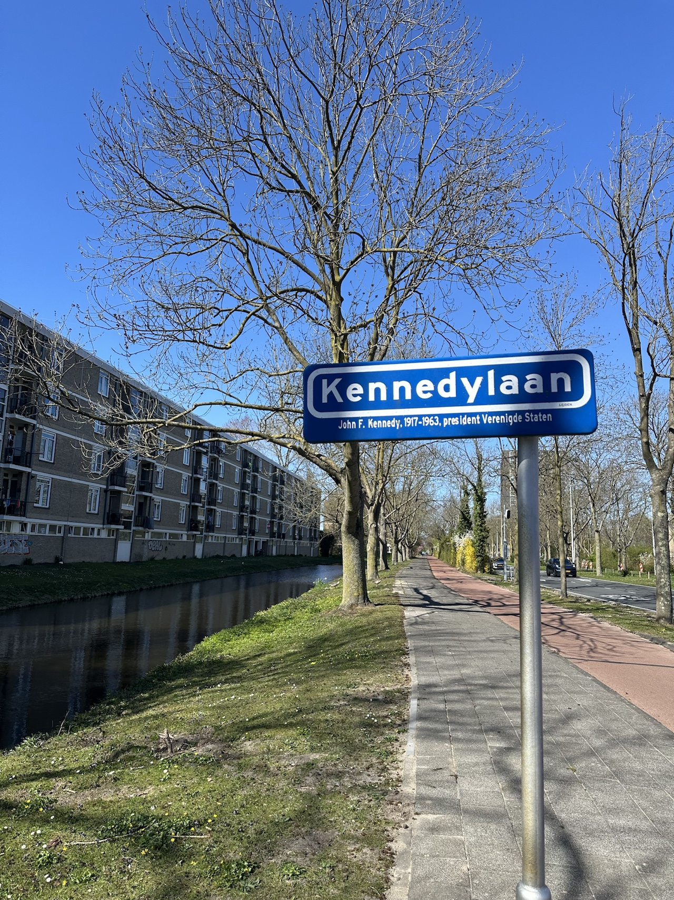
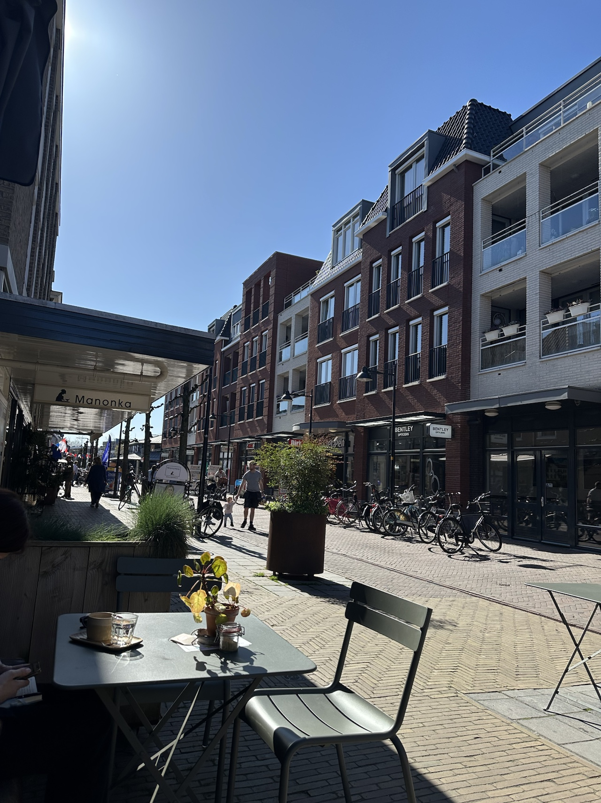

## Beginning my cycling journey

During my time living in Chicago, I became an avid cyclist. It had mostly replaced even the 'L' for the vast majority of my trips, and thanks to wonderful infrastructure like the Lake Shore Drive trail, it was often quite peaceful. Alas, one cannot be on the trail all the time, and then you enter mixed traffic and the fairly typical hodgepodge of cycling infrastructure that is often of varying quality in American cities. That experience is often less peaceful, but generally the norm.

## The abrupt stop

This cycling as a primary mode of transportation ceased fairly abruptly in November 2023, when I woke up out of the blue experiencing substantial back pain. It was surreal to be told I needed spine surgery at 34 years old, for no reason beyond just poor genetics and a spinal disc rupturing in just the right way to cause problems.

It was heartbreaking to lose the ability to cycle for a bit, but I was grateful to live in a walkable and transit oriented city nonetheless. Sitting for long periods of time was quite painful, but you can stand on the Subway when you need to -- you can't in a car. Walking was still totally viable, and a good way to still get regular movement. The road infrastructure in NYC can also be quite rough, and each bump in a car could flare up symptoms in a way that virtually never happened on the train.

## The recovery and fear of returning to the bike

By April 2025, post surgery and recovery, I was cleared to get back on the bike again. But it'd been 2 years...and both having gone through the injury and taking all that time away really amplified my fear of getting back on the bike. It doesn't help being extremely plugged into this advocacy and consistently hearing about the increase in traffic fatalities in NYC, the persistent cancellation of street safety improvements by then-Mayor Eric Adams, the NYPD cracking down on cyclists while essentially stopping any traffic enforcement for drivers...among others. I was just too skittish to get back on a bike.

That has changed, and I do ride again in NYC, but it took a long time to get there.

## Riding again for the first time - in The Netherlands

In April 2025 I spent the entire month living temporarily in Leiden, NL. I fell in love with this town, and I recall posting a few things on Bluesky highlighting my experiences. One of those experiences was, for the first time in nearly two years, getting back on a bike.

For the first week I was there...I just walked. I was a still a bit nervous to cycle again. I'd really built up this fear, perhaps unjustified, but it took a LONG TIME to unlearn the sort of subtle shifts in how I moved my body after 2 years in regular pain and recovery. Part of that was getting on a bike.

Logically, I knew I was in the Netherlands, and I'd read about how incredible the experience of cycling was there. I saw thousands of people cycling around town, the massive bike parking lots, the visibly separated and smooth cycle lanes everywhere I could see. I realized that if I wanted to rekindle this love of cycling, I was in one of the best places in the world to do it.

My host in Leiden had left me access to a pedal assisted e-bike. It was a very sunny and warm day with a light breeze; about the best weather one could ask for. After a simple breakfast, I opened up the map and decided that I would take a trip to the nearby town of Voorchoten, which is 7 kilometers (4.35 miles) away from where I was staying. I used to ride 25-35km fairly regularly; one of the final rides before my injury being the NYC 5 Boro Bike Tour at approximately 64km. I grabbed the keys, the battery to the e-bike, my helmet, and went down to get going.

It only took two minutes for the euphoria to come rushing in. The breeze, the smooth road, the extremely well designed and intelligent traffic signals that use sensors and not timers...it was like a dream. Yes, a few mildly annoyed cyclists zoomed past me, perhaps a little frustrated that I was going a bit slow and was a bit wobbly at first -- and there are definitely some unspoken rules of the road that I had to learn pretty quickly -- but despite it all, it was back. I remembered why I loved to cycle and it was like I never had any injury at all.

Along the way, I couldn't stop appreciating how lovely it was. Everyone cycles -- adults, children, elderly, tourists, locals, etc. There were folks in mobility scooters and wheelchairs; disproving any argument that bike lanes shouldn't be installed because people with disabilities have to drive. Through the open fields and windmills, I arrived about 25 minutes later in Voorchoten, where I walked the bike to a nearby café and sat outside on a beautiful pedestrian plaza enjoying the lovely day and feeling accomplished, proud, and as though I reconnected with an old friend.

## Takeaways

In the book [Curbing Traffic: The Human Case for Fewer Cars in Our Lives](https://press.princeton.edu/books/ebook/9781642831665/curbing-traffic-pdf) by Chris and Melissa Bruntlett, they chronicle their experience living in the Netherlands and the benefits that result from treating cars as visitors rather than owners of the road. It's a great read, and after this cycling experience and my overall time spent in The Netherlands, their perspective rings true and there is a lot that cities globally could learn by improving their cycling infrastructure and treating cycling as a first class citizen in our mobility pyramid.

"The Accessible City" (Chapter 7) resonated with me most. I have had multiple family members in my life with various mobility challenges -- along with my recent challenges -- and had bought into the "given fact" that cars were the best for mobility challenged individuals. For some, sure -- not for all. Not even for most, I'd argue. True mobility freedom comes from having choice; and what I saw in the Netherlands is that choice is enabled by infrastructure and policy choices that put people and the planet over cars.